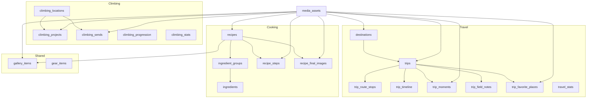
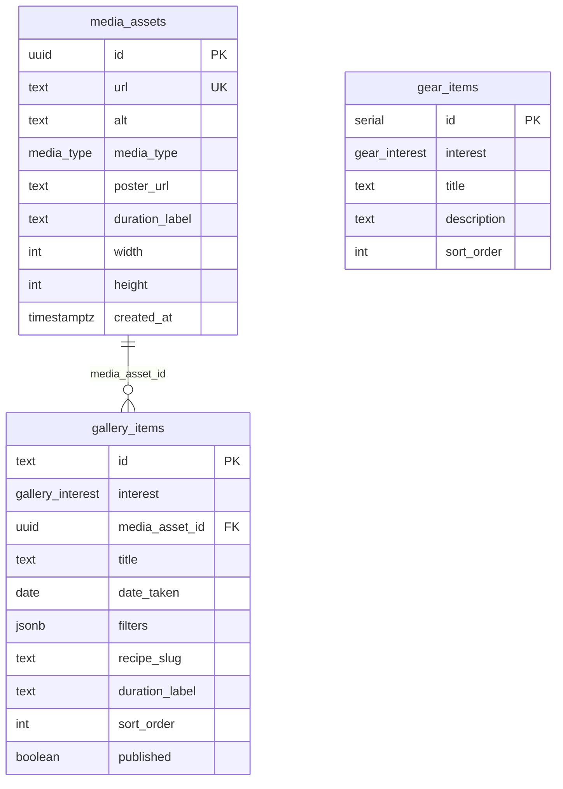
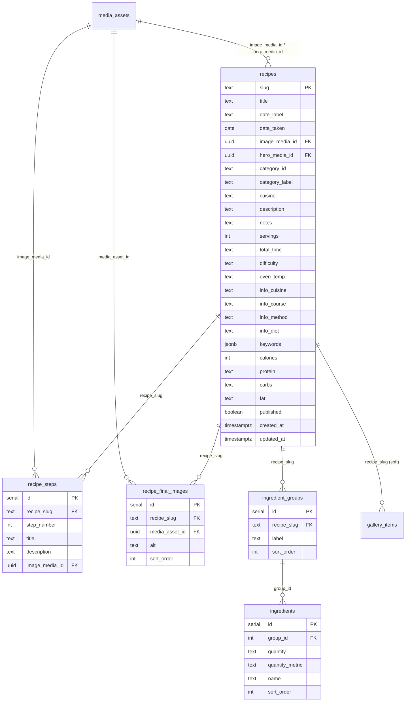
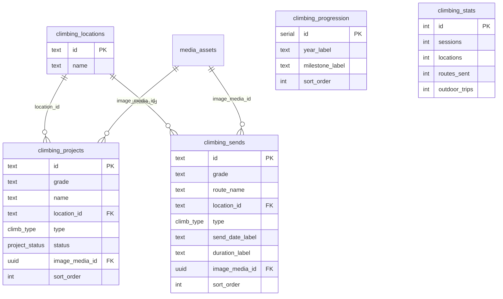

# Database Schema

**Last updated:** July 2026  
**Source of truth:** [`src/lib/db/schema/index.ts`](../src/lib/db/schema/index.ts)  
**Migrations:** [`drizzle/`](../drizzle/)

Postgres stores **content metadata and relationships**. Image/video **bytes** live in `public/images/` (today) or a CDN (planned). Tables store URLs only via `media_assets`.

---

## Overview



### Design rules

1. **`media_assets` is the single media registry** — every image/video URL lives here once.
2. **Domain tables reference media by UUID FK** — never store duplicate URL strings on content rows (except legacy path values that seed into `media_assets`).
3. **`gallery_items` is the browse layer** — one row per gallery card; `filters` JSON drives UI chips.
4. **Stats tables are singletons** (`id = 1`) for landing-page counters that are editorial, not computed.
5. **Site shell** (nav, interests, skills, personal bio) is **not** in Postgres yet.

### Enums

| Enum | Values |
|------|--------|
| `media_type` | `image`, `video` |
| `gallery_interest` | `travel`, `climbing`, `cooking` |
| `gear_interest` | `cooking`, `climbing` |
| `climb_type` | `lead`, `bouldering`, `top-rope` |
| `project_status` | `in-progress`, `projecting`, `on-deck` |

---

## Shared tables

### `media_assets`

Canonical store for every media URL used by content.

| Column | Type | Notes |
|--------|------|-------|
| `id` | uuid PK | default random |
| `url` | text unique | e.g. `/images/travel/oman/hero-oman.jpg` or CDN URL |
| `alt` | text | optional |
| `media_type` | enum | `image` (default) or `video` |
| `poster_url` | text | video thumbnail |
| `duration_label` | text | e.g. `0:42` |
| `width` / `height` | int | optional |
| `created_at` | timestamptz | |

### `gallery_items`

Unified browse surface for `/gallery/travel|climbing|cooking`.

| Column | Type | Notes |
|--------|------|-------|
| `id` | text PK | stable string id (`recipe-slug`, `climb-1`, `oman-hero`) |
| `interest` | enum | which gallery |
| `media_asset_id` | uuid FK → media_assets | display image/video |
| `title` | text | |
| `date_taken` | date | |
| `filters` | jsonb | e.g. `{ "category": "dinner", "cuisine": "italian" }` |
| `recipe_slug` | text | optional link to recipe detail |
| `duration_label` | text | climbing session length display |
| `sort_order` | int | |
| `published` | boolean | |

**Typical filter keys by interest:**

| Interest | `filters` keys |
|----------|----------------|
| cooking | `category`, `cuisine` |
| climbing | `location`, `type`, `grade` |
| travel | `trip`, `category` (+ year from `date_taken`) |

### `gear_items`

Shared gear lists for cooking and climbing landings.

| Column | Type |
|--------|------|
| `id` | serial PK |
| `interest` | enum (`cooking` \| `climbing`) |
| `title`, `description` | text |
| `sort_order` | int |



---

## Cooking



**Public mapping:** `RecipeDetail` in [`src/lib/types/recipe.ts`](../src/lib/types/recipe.ts) ← `getRecipeBySlug` in [`src/lib/db/queries/recipes.ts`](../src/lib/db/queries/recipes.ts).

---

## Climbing



**Location ids today:** `the-hive`, `home-gym`, `reach`, `outdoor`.

**Public mapping:** landing uses projects, stats, progression, gear; gallery uses `gallery_items` where `interest = 'climbing'`.

---

## Travel

```mermaid
erDiagram
  destinations ||--o| trips : "id shared PK/FK"
  media_assets ||--o{ destinations : image_media_id
  media_assets ||--o{ trips : "hero / route_map / gear"
  media_assets ||--o{ trip_moments : image_media_id
  media_assets ||--o{ trip_favorite_places : image_media_id
  trips ||--o{ trip_route_stops : trip_id
  trips ||--o{ trip_timeline : trip_id
  trips ||--o{ trip_moments : trip_id
  trips ||--o{ trip_field_notes : trip_id
  trips ||--o{ trip_favorite_places : trip_id

  destinations {
    text id PK
    text display_number
    text title
    text subtitle
    int photos_count
    int notes_count
    text date_label
    uuid image_media_id FK
    real map_x
    real map_y
    int sort_order
  }

  trips {
    text id PK_FK
    text country
    text date_label
    text summary
    uuid hero_media_id FK
    int stat_days
    int stat_regions
    int stat_photos
    int stat_countries
    uuid route_map_media_id FK
    uuid gear_media_id FK
    text reflection_excerpt
    text reflection_slug
  }

  trip_route_stops {
    serial id PK
    text trip_id FK
    text name
    real coord_x
    real coord_y
    int sort_order
  }

  trip_timeline {
    serial id PK
    text trip_id FK
    text day_label
    text label
    int sort_order
  }

  trip_moments {
    serial id PK
    text trip_id FK
    text title
    int photo_count
    uuid image_media_id FK
    int sort_order
  }

  trip_field_notes {
    serial id PK
    text trip_id FK
    text note_text
    int sort_order
  }

  trip_favorite_places {
    serial id PK
    text trip_id FK
    text title
    text location
    text description
    uuid image_media_id FK
    int sort_order
  }

  travel_stats {
    int id PK
    int places
    text photos_label
    text notes_label
    text memories_label
  }
```

**Note:** Every destination has a card row. Only destinations with a `trips` row have a detail page (today: `oman`). Others still 404 on `/travel/[id]` until trip detail is added.

---

## Cascade / delete behavior

| Relationship | On delete |
|--------------|-----------|
| Content → `media_assets` | `restrict` (don’t orphan media accidentally) |
| Recipe children → `recipes` | `cascade` |
| Trip children → `trips` | `cascade` |
| `trips` → `destinations` | `cascade` |
| Step image → `media_assets` | `set null` |

---

## Query layer

| Module | Main exports |
|--------|----------------|
| [`queries/recipes.ts`](../src/lib/db/queries/recipes.ts) | `getRecipeBySlug`, `getAllRecipes`, `getCookingStats`, `getCookingGearItems` |
| [`queries/climbing.ts`](../src/lib/db/queries/climbing.ts) | `getClimbingStats`, `getClimbingProjects`, `getClimbingProgression`, `getClimbingGearItems` |
| [`queries/travel.ts`](../src/lib/db/queries/travel.ts) | `getDestinations`, `getTravelStats`, `getTripById`, `getTravelGalleryConfig` |
| [`queries/gallery.ts`](../src/lib/db/queries/gallery.ts) | `getGalleryItems(interest, filters)` |

Seed: [`src/lib/db/seed.ts`](../src/lib/db/seed.ts) — idempotent upsert from legacy TS modules.

---

## Related docs

- [Application architecture](application-architecture.md) — runtime routes, admin, migration status
- [ARCHITECTURE.md](../ARCHITECTURE.md) — original UI/design blueprint
